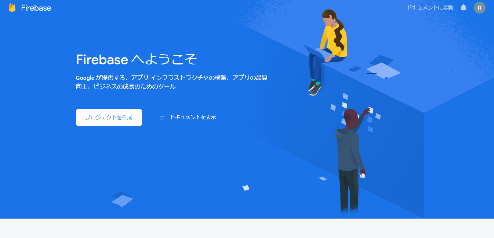
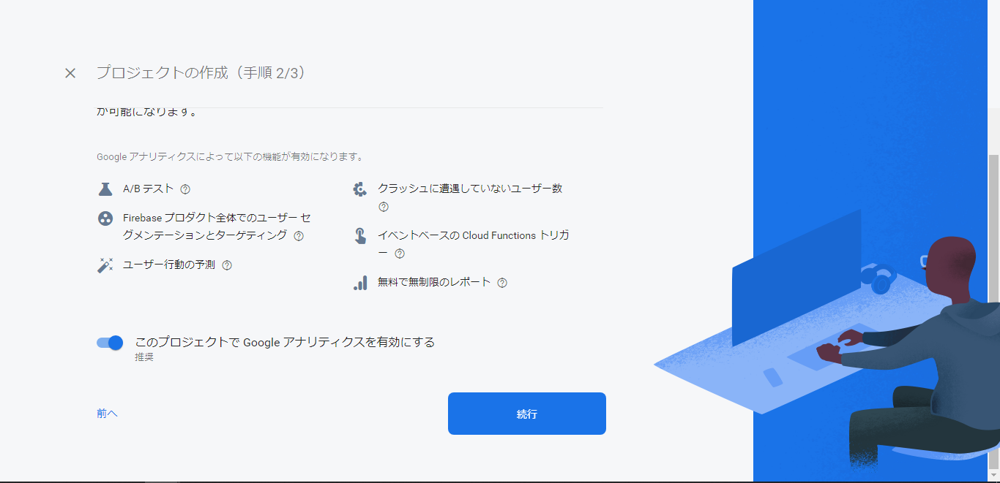
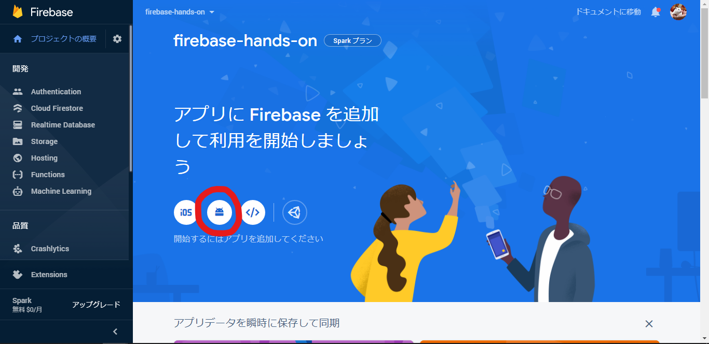
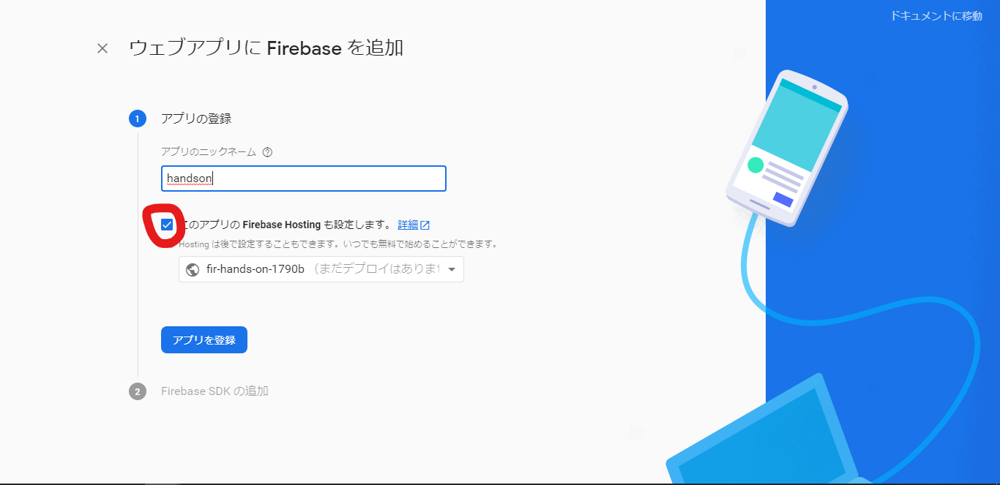
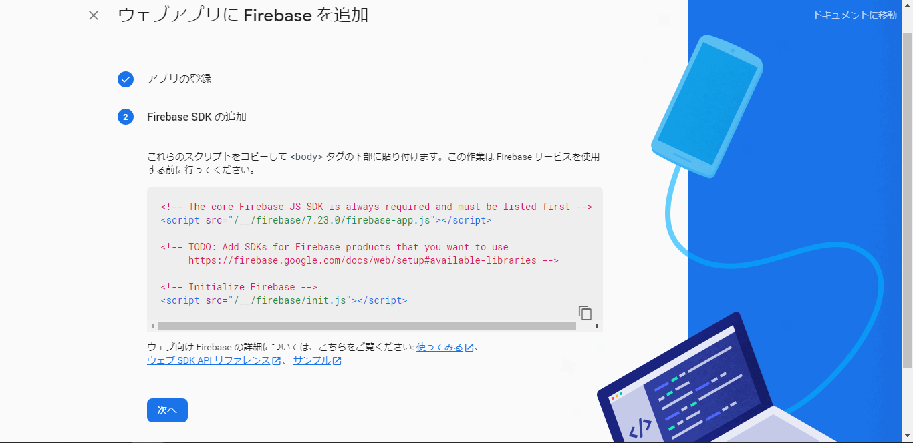

author: ReERishun
summary: Firebaseハンズオン資料
id: docs
categories: codelab,markdown
environments: Web
status: Published
feedback link: A link where users can go to provide feedback (Maybe the git repo)
analytics account: Google Analytics ID

# Firebase×JavaScript 1DAY実践ハンズオン

## Firebaseを学ぼう！
Duration: 0:05:00

今回はFirebaseについて学びますが、まずは「Firebaseとは？」という部分から解説からしていきます。

### Firebaseとは
Firebaseとは、Firebase Incが開発し、現在では買収先のGoogleが提供しているモバイル・Webアプリケーション開発プラットフォームです。


### 今回学ぶ製品
Firebaseには18個以上の製品があります。
今回はその中から3つ利用します。


## 新規プロジェクトの作成
Duration: 0:10:00

それでは、最初に新規のプロジェクトを作成します。
まずは下記ボタンからコンソールを開いてください。

<button>
  [Firebaseコンソールへ移動](https://console.firebase.google.com/)
</button>

以下の画面が表示されたかと思いますので、**[プロジェクトの作成]**をクリックしてください。



### プロジェクト名の指定
プロジェクト名を決めます。
基本的に半角英数字で指定してください。


尚、「-!'"」の記号は使用できます。


### Googleアナリティク
アナリティクスをOFFにしてください。
その後、[続行]を押して下さい。



### 作成完了
下の画面のようにプロジェクトの作成が完了したら[続行]を押してください。


## Webアプリの追加
Duration: 0:05:00

Webアプリケーションを追加します。
プロジェクトのホーム画面からWebのロゴをクリックしてください。



名前を指定して、[このアプリのFirebase Hostingも設定します。]にチェックを入れます。



FirebaseSDKを追加します。
表示されているスクリプトをコピーしてください。



index.htmlのhead内の「Firebase追加部分」にペーストしてください。

```html
<!DOCTYPE html>
<html>
  <head>
    <meta charset="utf-8">
    <meta name="viewport" content="width=device-width, initial-scale=1">
    <title>Welcome to Firebase Hosting</title>

    <!-- Firebase SDKの追加部分 開始 -->
    <!-- The core Firebase JS SDK is always required and must be listed first -->
    <script src="/__/firebase/7.23.0/firebase-app.js"></script>

    <!-- TODO: Add SDKs for Firebase products that you want to use
        https://firebase.google.com/docs/web/setup#available-libraries -->

    <!-- Initialize Firebase -->
    <script src="/__/firebase/init.js"></script>
    <!-- Firebase SDKの追加部分 終了 -->

    <link rel="stylesheet" href="./css/style.css">
  </head>
```


## プロジェクト
Duration: 0:05:00