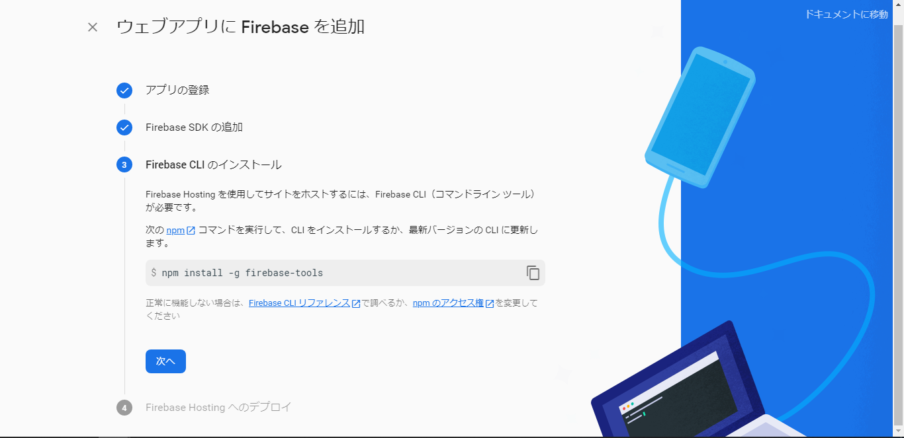
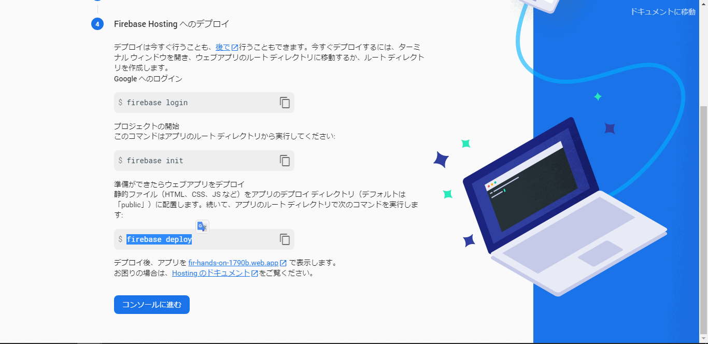

author: ReERishun
summary: Firebaseハンズオン資料
id: docs
categories: codelab,markdown
environments: Web
status: Published
feedback link: A link where users can go to provide feedback (Maybe the git repo)
analytics account: Google Analytics ID

# Firebase×JavaScript 1DAY実践ハンズオン

## Firebaseを学ぼう！
Duration: 0:05:00

今回はFirebaseについて学びますが、まずは「Firebaseとは？」という部分から解説からしていきます。

### Firebaseとは
Firebaseとは、Firebase Incが開発し、現在では買収先のGoogleが提供しているモバイル・Webアプリケーション開発プラットフォームです。


### 今回学ぶ製品
Firebaseには18個以上の製品があります。
今回はその中から3つ利用します。

### Firebase 

### Firebase Hosting

Firebase Hostingは、作成したWebアプリケーションを簡単にホスティングできるサービスです。

[Firebase Hosting - Firebase](https://firebase.google.com/products/hosting?hl=ja)

### Realtime Database

Realtime Databaseはリアルタイムでデータを共有/同期できるNoSQLのデータベースです。

[Firebase Realtime Database - Firebase](https://firebase.google.com/products/realtime-database?hl=ja)
[NoSQLについて勉強する。 - Qiita](https://qiita.com/t_nakayama0714/items/0ff7644666f0122cfba1)

## 新規プロジェクトの作成
Duration: 0:10:00

それでは、最初に新規のプロジェクトを作成します。
まずは下記ボタンからコンソールを開いてください。

<button>
  [Firebaseコンソールへ移動](https://console.firebase.google.com/)
</button>

以下の画面が表示されたかと思いますので、**[プロジェクトの作成]**をクリックしてください。


### プロジェクト名の指定
プロジェクト名を決めます。
基本的に半角英数字で指定してください。


尚、「-!'"」の記号は使用できます。


### Googleアナリティク
アナリティクスをOFFにしてください。
その後、[続行]を押して下さい。


### 作成完了
下の画面のようにプロジェクトの作成が完了したら[続行]を押してください。


## Webアプリの追加
Duration: 0:05:00

Webアプリケーションを追加します。
プロジェクトのホーム画面からWebのロゴをクリックしてください。


名前を指定して、[このアプリのFirebase Hostingも設定します。]にチェックを入れます。


FirebaseSDKを追加します。
表示されているスクリプトをコピーしてください。


index.htmlのhead内の「Firebase SDKの追加部分」にペーストしてください。

```html
<!DOCTYPE html>
<html>
  <head>
    <meta charset="utf-8">
    <meta name="viewport" content="width=device-width, initial-scale=1">
    <title>Welcome to Firebase Hosting</title>

    <!-- Firebase SDKの追加部分 開始 -->
    <!-- The core Firebase JS SDK is always required and must be listed first -->
    <script src="/__/firebase/7.23.0/firebase-app.js"></script>

    <!-- TODO: Add SDKs for Firebase products that you want to use
        https://firebase.google.com/docs/web/setup#available-libraries -->

    <!-- Initialize Firebase -->
    <script src="/__/firebase/init.js"></script>
    <!-- Firebase SDKの追加部分 終了 -->

    <link rel="stylesheet" href="./css/style.css">
  </head>
```

続いてFirebaseCLIのインストールについて出てきますが、こちらは事前準備の際に行っていただいた内容になりますので、そのまま次に進んでいただいて大丈夫です。



続いてもひとまず飛ばして、コンソールへ進んでください。



これで、FirebaseへのWebアプリケーションの追加が完了しました。

## テンプレートのダウンロード
Duration: 0:03:00

今回は、1からCSSやHTMLを書いていくのは大変ですので、こちらで用意したプロジェクトを基に開発していただきます。
GitHub上にコードが置いてあるので、GitHubを利用したことのある方は、cloneをお願い致します。

### GitHubを利用されている方

任意のディレクトリにてクローンしてください。

```console
git clone git@github.com:OthloTech/firebase-hands-on.git
```

### GitHubを利用されていない方

まずは、以下のサイトにアクセスしてください。

[OthloTech/firebase-hands-on - GitHub](https://github.com/OthloTech/firebase-hands-on)

続いて、緑色のcodeボタンを押して、「Download ZIP」を押してZIPファイルをダウンロードしてください。


ダウンロードした zipファイルを開き、中のプロジェクトを任意のディレクトリにペーストしてください。

## Firebase CLIでの初期化
Duration: 0:08:00

事前準備の際にインストールしていただいたFirebase CLIを利用していきます。
まずは先程プロジェクトをクローン/ペーストしたディレクトリに移動し、初期化を行います。

```console
$ firebase init
```
以下のような質問が表示された場合は`y`と答えてください。

```
? Are you ready to proceed? (Y/n) y
```

続いて、利用する製品を選択します。
今回は、
- RealtimeDatabase
- Hosting
を利用するので、**Database**と**Hosting**を選択してください。

```console
? Which Firebase CLI features do you want to set up for this folder? Press Space to select features, then Enter to confirm your choices.
❯◉ Database: Deploy Firebase Realtime Database Rules
 ◯ Firestore: Deploy rules and create indexes for Firestore
 ◯ Functions: Configure and deploy Cloud Functions
❯◉ Hosting: Configure and deploy Firebase Hosting sites
 ◯ Storage: Deploy Cloud Storage security rules
 ◯ Emulators: Set up local emulators for Firebase features
 ◯ Remote Config: Get, deploy, and rollback configurations for Remote Config
```
選択方法はスペースキーを押すと選択できます。十字キーで移動し、選択完了後はEnterキーを押してください。

続いて、プロジェクトの選択を行います。
実は先程ブラウザ上で行ったプロジェクト作成作業はCLIでもできるのですが、今回は作成してあるので、「Use an existing project」を選択します。

```
? Please select an option:
  Use an existing project
> Create a new project
  Add Firebase to an existing Google Cloud Platform project
  Don't set up a default project
```

先程作成したプロジェクトを選択してください。

```console
? Select a default Firebase project for this directory:
> fir-hands-on-xxx (firebase-hands-on)
```

後は以下のように答えてください。

```console
? What do you want to use as your public directory? public
? Configure as a single-page app (rewrite all urls to /index.html)? No
+  Wrote public/404.html
? File public/index.html already exists. Overwrite? No
```

## Databaseの設定


## プロジェクト
Duration: 0:05:00