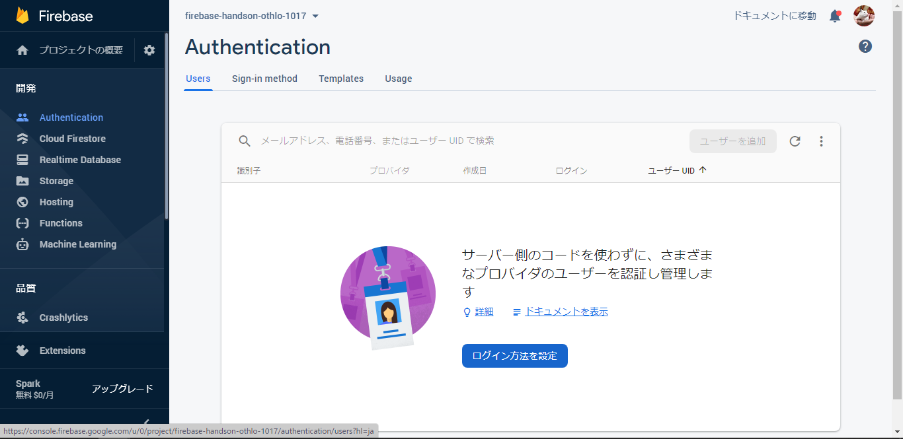
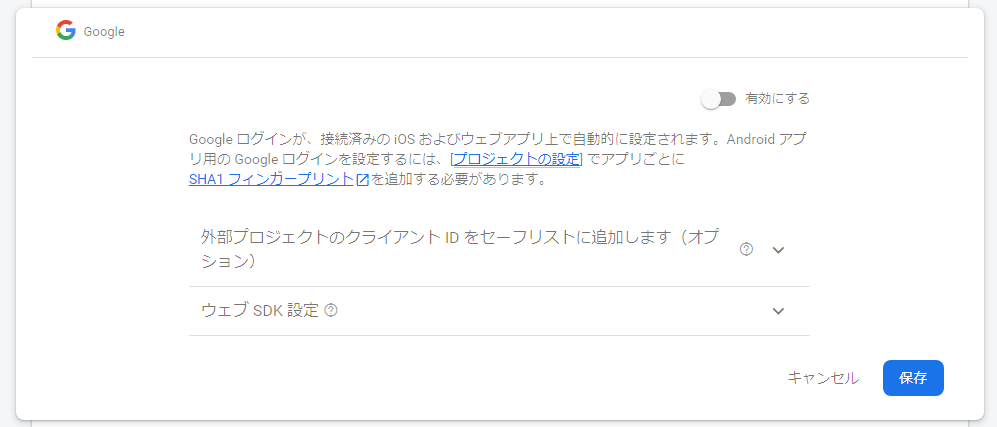
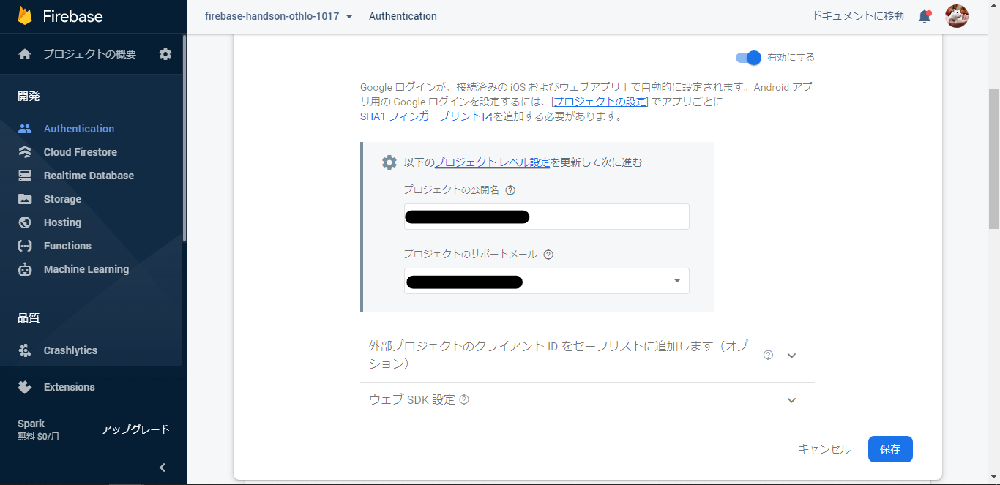
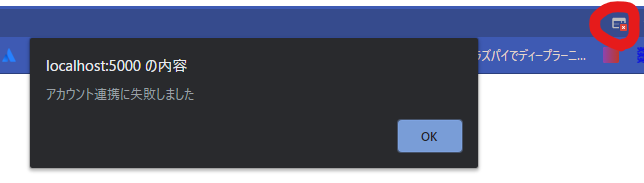
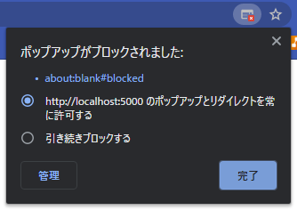
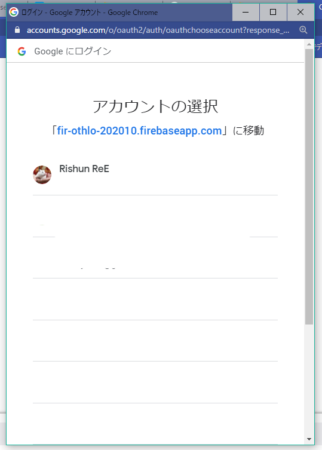
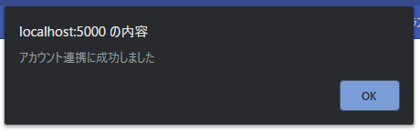

author: ReERishun
summary: Firebaseハンズオン資料
id: docs
categories: codelab,markdown
environments: Web
status: Published
feedback link: A link where users can go to provide feedback (Maybe the git repo)
analytics account: Google Analytics ID

# Firebase×JavaScript 1DAY実践ハンズオン

## Firebaseを学ぼう！
Duration: 0:05:00

今回はFirebaseについて学びますが、まずは「Firebaseとは？」という部分から解説からしていきます。

### Firebaseとは
Firebaseとは、Firebase Incが開発し、現在では買収先のGoogleが提供しているモバイル・Webアプリケーション開発プラットフォームです。


### 今回学ぶ製品
Firebaseには18個以上の製品があります。
今回はその中から3つ利用します。

### Firebase Authentication


[]

### Firebase Hosting

Firebase Hostingは、作成したWebアプリケーションを簡単にホスティングできるサービスです。

[Firebase Hosting - Firebase](https://firebase.google.com/products/hosting?hl=ja)

### Realtime Database

Realtime Databaseはリアルタイムでデータを共有/同期できるNoSQLのデータベースです。

[Firebase Realtime Database - Firebase](https://firebase.google.com/products/realtime-database?hl=ja)
[NoSQLについて勉強する。 - Qiita](https://qiita.com/t_nakayama0714/items/0ff7644666f0122cfba1)

## 新規プロジェクトの作成（GUIの場合）
Duration: 0:10:00

それでは、最初に新規のプロジェクトを作成します。
まずは下記ボタンからコンソールを開いてください。

<button>
  [Firebaseコンソールへ移動](https://console.firebase.google.com/)
</button>

以下の画面が表示されたかと思いますので、**[プロジェクトの作成]**をクリックしてください。


### プロジェクト名の指定
プロジェクト名を決めます。
基本的に半角英数字で指定してください。


尚、「-!'"」の記号は使用できます。


### Googleアナリティク
アナリティクスをOFFにしてください。
その後、[続行]を押して下さい。


### 作成完了
下の画面のようにプロジェクトの作成が完了したら[続行]を押してください。


## Webアプリの追加（GUIの場合）
Duration: 0:05:00

Webアプリケーションを追加します。
プロジェクトのホーム画面からWebのロゴをクリックしてください。


名前を指定して、[このアプリのFirebase Hostingも設定します。]にチェックを入れます。


FirebaseSDKを追加します。
表示されているスクリプトをコピーしてください。


index.htmlのhead内の「Firebase SDKの追加部分」にペーストしてください。

```html
<!DOCTYPE html>
<html>
  <head>
    <meta charset="utf-8">
    <meta name="viewport" content="width=device-width, initial-scale=1">
    <title>Welcome to Firebase Hosting</title>

    <!-- Firebase SDKの追加部分 開始 -->
    <!-- The core Firebase JS SDK is always required and must be listed first -->
    <script src="/__/firebase/7.23.0/firebase-app.js"></script>

    <!-- TODO: Add SDKs for Firebase products that you want to use
        https://firebase.google.com/docs/web/setup#available-libraries -->

    <!-- Initialize Firebase -->
    <script src="/__/firebase/init.js"></script>
    <!-- Firebase SDKの追加部分 終了 -->

    <link rel="stylesheet" href="./css/style.css">
  </head>
```

続いてFirebaseCLIのインストールについて出てきますが、こちらは事前準備の際に行っていただいた内容になりますので、そのまま次に進んでいただいて大丈夫です。


続いてもひとまず飛ばして、コンソールへ進んでください。


これで、FirebaseへのWebアプリケーションの追加が完了しました。

## テンプレートのダウンロード
Duration: 0:03:00

今回は、1からCSSやHTMLを書いていくのは大変ですので、こちらで用意したプロジェクトを基に開発していただきます。
GitHub上にコードが置いてあるので、GitHubを利用したことのある方は、cloneをお願い致します。

### GitHubを利用されている方

任意のディレクトリにてクローンしてください。

```console
git clone git@github.com:OthloTech/firebase-hands-on.git
```

### GitHubを利用されていない方

まずは、以下のサイトにアクセスしてください。

[OthloTech/firebase-hands-on - GitHub](https://github.com/OthloTech/firebase-hands-on)

続いて、緑色のcodeボタンを押して、「Download ZIP」を押してZIPファイルをダウンロードしてください。


ダウンロードした zipファイルを開き、中のプロジェクトを任意のディレクトリにペーストしてください。

## Firebase CLIでの初期化
Duration: 0:08:00

事前準備の際にインストールしていただいたFirebase CLIを利用していきます。
まずは先程プロジェクトをクローン/ペーストしたディレクトリに移動し、初期化を行います。

```console
$ firebase init
```
以下のような質問が表示された場合は`y`と答えてください。

```
? Are you ready to proceed? (Y/n) y
```

続いて、利用する製品を選択します。
今回は、
- RealtimeDatabase
- Hosting
を利用するので、**Database**と**Hosting**を選択してください。

```console
? Which Firebase CLI features do you want to set up for this folder? Press Space to select features, then Enter to confirm your choices.
❯◉ Database: Deploy Firebase Realtime Database Rules
 ◯ Firestore: Deploy rules and create indexes for Firestore
 ◯ Functions: Configure and deploy Cloud Functions
❯◉ Hosting: Configure and deploy Firebase Hosting sites
 ◯ Storage: Deploy Cloud Storage security rules
 ◯ Emulators: Set up local emulators for Firebase features
 ◯ Remote Config: Get, deploy, and rollback configurations for Remote Config
```
選択方法はスペースキーを押すと選択できます。十字キーで移動し、選択完了後はEnterキーを押してください。

続いて、プロジェクトの選択を行います。
実は先程ブラウザ上で行ったプロジェクト作成作業はCLIでもできるのですが、今回は作成してあるので、「Use an existing project」を選択します。

```
? Please select an option:
  Use an existing project
> Create a new project
  Add Firebase to an existing Google Cloud Platform project
  Don't set up a default project
```

プロジェクトのIDを指定してください。
但し、IDは必ず全体で一意のIDである必要があるため、ありふれた名前はお勧めしません。

```
? Please select an option: Create a new project
i  If you want to create a project in a Google Cloud organization or folder, please use "firebase projects:create" instead, and return to this command when you've created the project.
? Please specify a unique project id (warning: cannot be modified afterward) [6-30 characters]:
 () ここにプロジェクトのIDを指定
```

作成するプロジェクトの名前を指定してください。
```
? What would you like to call your project? (defaults to your project ID)
```
ここはエンターキーを押せば先程指定したIDが指定されます。
コンソールでの表示名に使用されたりするので、分かり易い名前を付けてみてはどうでしょうか？


あとはほとんどEnterで大丈夫です。

データベースのルールを記載するファイルの名前を聞いてます。
デフォルトで大丈夫なのでEnter
```
? What file should be used for Database Rules? (database.rules.json)
```

公開するディレクトリを聞いています。
今回こちらで用意したプロジェクトではpublicディレクトリが公開するディレクトリであるため、デフォルトのままでエンターキーを押してください。

```
What do you want to use as your public directory? (public)
```

Noで大丈夫です。

```
? Configure as a single-page app (rewrite all urls to /index.html)? (y/N) 
? File public/404.html already exists. Overwrite? No
? File public/index.html already exists. Overwrite? No
```

## Databaseの設定
Duration: 0:05:00

さて、これで大体の準備が整ったので、早速色々と開発していきたいのですが、その前に更に一つ。
今回利用予定の製品の1つ、RealTimeDatabaseのルールを定義している「database.rules.json」の編集を行います。

```json
{
  /* Visit https://firebase.google.com/docs/database/security to learn more about security rules. */
  "rules": {
    ".read": false,
    ".write": false
  }
}
```

初期状態ではこのようになっているかと思います。
これを、以下のように書き換えてください。

```json
{
  /* Visit https://firebase.google.com/docs/database/security to learn more about security rules. */
  "rules": {
    ".read": true,
    ".write": true
  }
}
```

ここで何を変更したのかというと、
- データベースの読み取りがfalse（誰でも読み取り不可）をtrue（誰でも読み取り可）
- データベースの書き込みがfalse（誰でも書き込み不可）をtrue（誰でも書き込み可）
という風に変更しました。これは誰でも読み書きができるという点では安全性に問題があります。


## サーバとデプロイ
Duration: 0:05:00

今回利用するFirebaseHostingには開発したアプリケーションを簡単にデプロイできるコマンドが用意されています。

```console
$ firebase deploy
```

コマンド実行後、デプロイが完了すると以下のようにURLがコンソールに表示されます。

```
Hosting URL: https://xxxxxxxxxxx.web.app
```

xx～の部分には最初に指定したプロジェクトのIDが入っており、このページにアクセスすると実際に開発したものが確認できます。

しかし、毎回デプロイせずともローカルでもしっかりと確認したいですよね？
その場合は以下のコマンドでローカルでも確認できます。

```console
$ firebase serve
```

今回のハンズオンでは基本的にローカルでの確認を行いながら進めていきます。

## Authenticationの設定
Duration: 0:05:00

Authentication（認証機能）の設定を行います。
今回はGoogleアカウントによる認証のみに対応させます。

右側のナビゲーションから**Authentication**を選択し、**Sign-in method**のタブを開いてください。



認証方法の一覧が表示されますので、Googleをクリックして下さい。



表示されたら、
1. **有効にする**をONに
2. **プロジェクトのサポートメール**を選択
3. **保存**を押してください。



以上で Authentication の設定は完了です。

## Firebaseのスクリプトの読み込み
Duration: 0:02:00

Firebase用のSDKを追加します。
`public/index.html`を開き、以下のように`<!-- FirebaseのSDK追加部分 -->`の部分にSDKを追加してください。

```html
<!DOCTYPE html>
<html>
<head>
  <meta charset="utf-8">
  <meta name="viewport" content="width=device-width, initial-scale=1">
  <title>ChatApp</title>

  <!-- FirebaseのSDK追加部分 開始 -->
  <script defer src="/__/firebase/7.23.0/firebase-app.js"></script>
  <script defer src="/__/firebase/7.23.0/firebase-auth.js"></script>
  <script defer src="/__/firebase/7.23.0/firebase-database.js"></script>
  <script defer src="/__/firebase/init.js"></script>
  <!-- FirebaseのSDK追加部分 終了 -->

  <link rel="stylesheet" href="./css/style.css">
  <link href="https://fonts.googleapis.com/css2?family=Noto+Sans+JP&display=swap" rel="stylesheet">
</head>
```

## 認証処理の作成
Duration: 0:10:00

それでは、認証処理を実装していきます。

### 認証処理の作成

`public/js/index.js`へ以下のコードを追加します。

```javascript
// 認証処理作成箇所
function auth() {
  const provider = new firebase.auth.GoogleAuthProvider();
  // Google認証のポップアップ表示
  firebase
    .auth()
    .signInWithPopup(provider)
    .then((result) => {
      // 認証成功
      const user = result.user;
      enableMessages(user);
    })
    .catch(function (error) {
      // 認証失敗
      alert("アカウント連携に失敗しました");
      console.log({ error });
    });
}
```

ここでは、Google認証のポップアップを呼び出し認証を行った結果を受け取ります。

1. Googleプロバイダオブジェクトのインスタンスを作成
```javascript
  const provider = new firebase.auth.GoogleAuthProvider();
```
2. 認証処理
```javascript
firebase
    .auth()
    .signInWithPopup(provider)
    .then((result) => {
      // 認証成功
      const user = result.user;
      enableMessages(user);
    })
    .catch(function (error) {
      // 認証失敗
      alert("アカウント連携に失敗しました");
      console.log({ error });
    });
```
3. 成功した場合、認証結果（ユーザ情報）を受け取る
```javascript
    .then((result) => {
      // 認証成功
      const user = result.user;
      enableMessages(user);
    })
```
4. 失敗した場合、エラーをアラートにて表示
```javascript
    .catch(function (error) {
      // 認証失敗
      alert("アカウント連携に失敗しました");
      console.log({ error });
    });
```

### ページを開いた際に認証を呼び出す

作成した認証処理をページのロード時に呼び出すようにします。
以下のコードを追記してください。

```javascript
// 認証の呼び出し箇所
document.addEventListener("DOMContentLoaded", () => {
  // DOMのリロードが終わったタイミングで認証開始
  auth();
});
```

このコードにより、ページを読み込むたびに認証を行うようになりました。

### テスト

それでは、ローカルで動作チェックしてみましょう。
以下のコマンドを実行してローカルでアプリを起動してください。

```
$ firebase serve
```

続いて、localhost:5000にアクセスしてください。

<button>
  [ローカルでテスト](http://localhost:5000)
</button>

すると、早速ポップアップがブロックされてしまい認証が失敗してしまいます。



リンクバーにあるポップアップブロックのアイコンをクリックし、**http://localhost:5000 のポップアップとリダイレクトを常に許可する**にチェックを入れ、**完了**を押してください。



すると、画像のようにアカウント一覧が表示されるかと思います。



自身のアカウントを選択し、ログインしてください。
以下のようにポップアップが表示されればログイン成功です！



